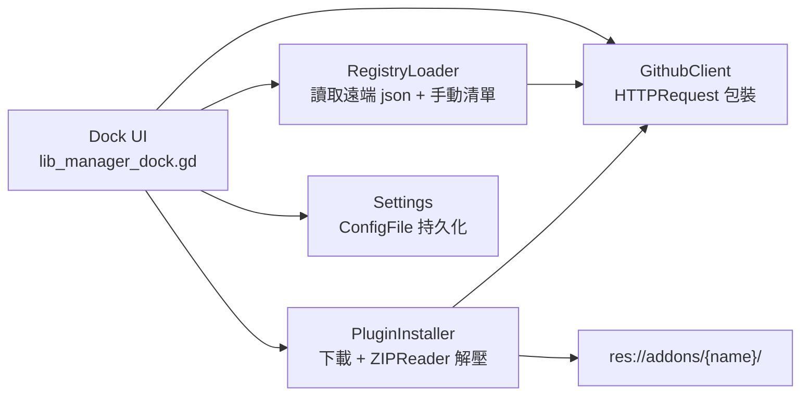

# Godot Lib Manager Plugin

## 架構總覽



## 目錄結構 (全部在 `addons/godot_lib_manager/` 下)

- `plugin.cfg` — Godot EditorPlugin manifest
- `plugin.gd` — `@tool extends EditorPlugin`,在底部面板加上 Lib Manager dock,enable/disable 時掛載與卸載 UI
- `core/github_client.gd` — 封裝 `HTTPRequest`,提供 `fetch_releases(owner, repo)`、`fetch_latest(owner, repo)`、`download_asset(url, dest_path)`,自動帶 `Accept: application/vnd.github+json` 與選用的 `Authorization: Bearer <token>` 標頭,並從回應 header 解析 `X-RateLimit-Remaining`
- `core/registry_loader.gd` — 合併兩種來源:
  - 遠端 JSON 註冊表 (使用者可在設定中加多個 URL,預設一個官方範本)
  - 手動加入的 `owner/repo` 字串
- `core/plugin_installer.gd` — 流程:取得 release → 找 `.zip` asset (優先名稱含 addon name) → 下載到 `user://gdlm_cache/` → 用 `ZIPReader` 開啟 → 只把以 `addons/` 開頭的 entry 解壓到 `res://` 對應位置 → 呼叫 `EditorInterface.get_resource_filesystem().scan()` 刷新
- `core/settings.gd` — 用 `ConfigFile` 存到 `user://godot_lib_manager.cfg`,內容包含 `[github] token`、`[sources] registries=[]` 與 `manual_repos=[]`、`[installed]` 每個已裝插件的 `{ source, version, addon_dirs }`
- `ui/lib_manager_dock.tscn` + `.gd` — VBox 內含 Toolbar (重新整理 / 加入 repo / 設定按鈕) + ItemList/卡片清單 + 詳細面板 (release 說明、版本下拉、安裝/更新/解除安裝按鈕)
- `ui/plugin_card.tscn` + `.gd` — 顯示名稱、描述、目前版本 vs 最新版本、狀態 badge

## 關鍵實作重點

### GithubClient (`core/github_client.gd`)

範例核心 API:

```gdscript
const API_BASE := "https://api.github.com"

func fetch_releases(owner: String, repo: String) -> Array:
    var url := "%s/repos/%s/%s/releases" % [API_BASE, owner, repo]
    var headers := _build_headers()
    # HTTPRequest.request(url, headers, HTTPClient.METHOD_GET)
    # await request_completed → JSON.parse_string(body) → return Array
```

- 用 `await http.request_completed` 把每次呼叫包成 coroutine,UI 端就可以 `await client.fetch_releases(...)`
- 每個 request 動態建立一次性 `HTTPRequest` 子節點,避免並發互相覆蓋
- 解析 response headers 撈 `X-RateLimit-Remaining` / `X-RateLimit-Reset` 顯示在 UI 底部,讓使用者知道是否該設 token

### PluginInstaller (`core/plugin_installer.gd`) — 只解壓 `addons/`

```gdscript
func install_from_zip(zip_path: String, expected_addon: String = "") -> Array[String]:
    var reader := ZIPReader.new()
    if reader.open(zip_path) != OK: return []
    var installed_dirs: Array[String] = []
    for entry in reader.get_files():
        # 規則:path 經過去掉 zip 內可能的 top-level 資料夾後,
        # 必須以 "addons/" 開頭才解壓
        var rel := _strip_top_dir(entry)
        if not rel.begins_with("addons/"): continue
        var dest := "res://" + rel
        DirAccess.make_dir_recursive_absolute(dest.get_base_dir())
        var f := FileAccess.open(dest, FileAccess.WRITE)
        f.store_buffer(reader.read_file(entry))
        # 紀錄頂層 addon 目錄供解除安裝使用
    reader.close()
    EditorInterface.get_resource_filesystem().scan()
    return installed_dirs
```

- `_strip_top_dir` 處理常見情況:有些 release zip 會把所有檔案包在 `repo-name-vX.Y.Z/` 下,要先把這層拿掉再判斷
- 下載前若該目錄已存在,提示使用者「將覆寫」或「先備份到 user://gdlm_backup」
- 解除安裝 = 讀 `[installed]` 的 `addon_dirs` 把 `res://addons/{name}/` 整個刪掉,然後再 scan

### Settings 與來源管理

`user://godot_lib_manager.cfg` 範例:

```ini
[github]
token=""

[sources]
registries=["https://raw.githubusercontent.com/<you>/godot-lib-registry/main/registry.json"]
manual_repos=["owner/repo-a", "owner/repo-b"]

[installed]
some_addon={"source":"owner/repo","version":"v1.2.3","addon_dirs":["addons/some_addon"]}
```

註冊表 JSON 格式 (RegistryLoader 期望):

```json
{
  "version": 1,
  "plugins": [
    {
      "name": "Awesome Plugin",
      "owner": "someuser",
      "repo": "awesome-plugin",
      "description": "短描述",
      "addon_dir": "awesome_plugin"
    }
  ]
}
```

### UI 流程

1. 啟用 plugin → `plugin.gd._enter_tree()` 建立 dock 並 `add_control_to_bottom_panel`
2. Dock 載入後呼叫 `RegistryLoader.load_all()` 取得插件清單,顯示為卡片
3. 點某張卡 → 背景 `await GithubClient.fetch_releases(owner, repo)` 顯示版本下拉
4. 按「安裝」→ `PluginInstaller.install(...)` → 完成後 toast 提示並建議到 Project Settings → Plugins 啟用
5. 已安裝插件比對 latest tag,若版本不同則顯示「更新」按鈕
6. 設定面板可填 PAT token、加/移除註冊表 URL、加/移除手動 repo

## 開發順序 (Todos 對應)

完整流程拆成下列任務,每個都是可獨立驗證的階段。
